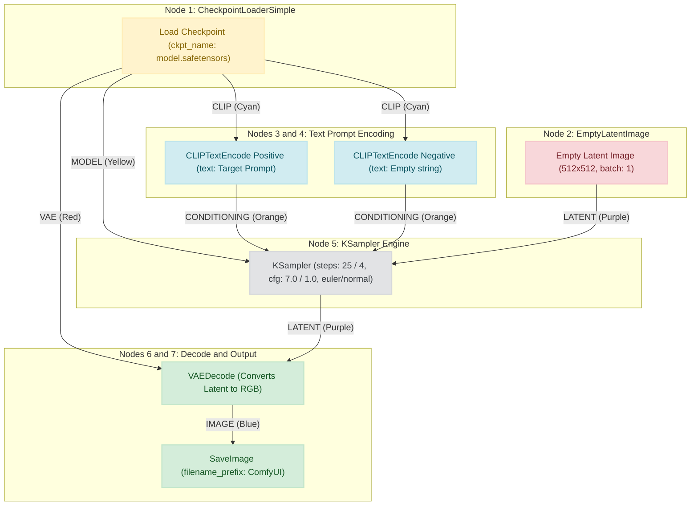

# Open-Source Image Generation Benchmark Guide

A comprehensive, reproducible local benchmarking toolkit and practitioner guide for evaluating open-source text-to-image foundation models on consumer hardware (8 GB VRAM).

This repository contains the complete evaluation framework, measurement dataset, prompt suite, dual-rater scoring system, interactive comparison gallery, and automated report/presentation compilers for benchmarking text-to-image models locally.

---

## Table of Contents

- [Research Question & Objectives](#research-question--objectives)
- [Models Evaluated](#models-evaluated)
- [1. ComfyUI Installation Guide](#1-comfyui-installation-guide)
- [2. Model Checkpoint Download Links](#2-model-checkpoint-download-links)
- [3. Where to Place Checkpoint Models](#3-where-to-place-checkpoint-models)
- [4. ComfyUI Node Setup, Wiring & Parameter Configuration](#4-comfyui-node-setup-wiring--parameter-configuration)
  - [Understanding the ComfyUI Node Interface](#understanding-the-comfyui-node-interface)
  - [Visual Pipeline Architecture](#visual-pipeline-architecture)
  - [Step-by-Step Node Creation and Configuration](#step-by-step-node-creation-and-configuration)
  - [Parameter Matrix by Model](#parameter-matrix-by-model)
  - [Loading Pre-Configured Workflow JSON Files](#loading-pre-configured-workflow-json-files)
- [5. Step-by-Step Execution Protocol](#5-step-by-step-execution-protocol)
- [Repository Structure](#repository-structure)
- [Hardware Environment Reference](#hardware-environment-reference)
- [Responsible AI & License Guidelines](#responsible-ai--license-guidelines)

---

## Research Question & Objectives

> **Which openly available text-to-image model provides the best balance of prompt adherence, visual quality, generation speed, and memory use on an 8 GB VRAM computer?**

### Evaluation Goals
1. **Prompt Adherence**: Faithfulness to subjects, spatial relationships, lighting, styling, and text rendering.
2. **Visual Quality & Composition**: Photographic realism, texture sharpness, coherent framing, and artistic balance.
3. **Execution Latency**: Time required to generate an image from prompt submission to disk write.
4. **Hardware Efficiency**: Peak VRAM consumption and system stability within an 8 GB VRAM budget.

---

## Models Evaluated

All models run strictly locally on consumer GPU hardware with pure local inference (one checkpoint loaded at a time, zero cloud offloading):

| Model | ID | Architecture | Native Resolution | Locked Benchmark Settings |
| :--- | :--- | :--- | :--- | :--- |
| **Stable Diffusion 1.5** | `SD15` | UNet (0.86B) + CLIP ViT-L/14 | 512 x 512 | 512x512, 25 steps, CFG 7.0, batch 1 |
| **SDXL Base 1.0** | `SDXL` | UNet (2.6B) + OpenCLIP / CLIP ViT-L | 1024 x 1024 | 512x512, 25 steps, CFG 7.0, batch 1 |
| **SDXL Turbo** | `TURBO` | Distilled ADD UNet (2.6B) | 512 x 512 | 512x512, 4 steps, CFG 1.0, batch 1 |

> [!NOTE]
> **Controlled Latency & Hardware Parity**: To ensure fair comparisons on 8 GB VRAM hardware, all three models are evaluated at 512 x 512 resolution with locked latent seeds and an empty negative prompt.

---

## 1. ComfyUI Installation Guide

ComfyUI is the primary local inference and execution engine for this benchmark.

### Option A: ComfyUI Desktop (Recommended for Windows 11)
1. Navigate to the official ComfyUI download portal: **[https://comfy.org/download/](https://comfy.org/download/)**
2. Download the Windows installer (`ComfyUI-Desktop-Setup.exe`).
3. Run the installer and follow the setup wizard. The installer automatically configures an isolated Python runtime, PyTorch, and CUDA acceleration.
4. Launch **ComfyUI Desktop** from the Start Menu or Desktop shortcut.

### Option B: ComfyUI Windows Portable Standalone (Zip / 7z)
1. Visit the official GitHub releases page: **[https://github.com/comfyanonymous/ComfyUI/releases](https://github.com/comfyanonymous/ComfyUI/releases)**
2. Download the release archive with NVIDIA GPU support: `ComfyUI_windows_portable_nvidia.7z`.
3. Extract the archive using 7-Zip to a dedicated directory (for example `C:\ComfyUI_windows_portable`).
4. To start ComfyUI, double-click:
   ```bat
   run_nvidia_gpu.bat
   ```

### Option C: Linux / macOS Installation
```bash
# Clone ComfyUI repository
git clone https://github.com/comfyanonymous/ComfyUI.git
cd ComfyUI

# Create virtual environment
python3 -m venv venv
source venv/bin/activate

# Install PyTorch with CUDA (Linux)
pip install torch torchvision torchaudio --extra-index-url https://download.pytorch.org/whl/cu124

# Install ComfyUI dependencies
pip install -r requirements.txt

# Start ComfyUI
python main.py
```

### Verifying Local Execution
- Open your web browser and navigate to:
  ```
  http://127.0.0.1:8188
  ```
- ComfyUI will present an interactive node canvas.
- **Security Rule**: Keep ComfyUI bound strictly to `127.0.0.1` (localhost). Never bind to `0.0.0.0` or expose the port to external networks without proper authentication.

---

## 2. Model Checkpoint Download Links

Download the official `.safetensors` model weights directly from their respective Hugging Face repositories:

1. **Stable Diffusion 1.5 (`SD15`)**
   - **Repository**: [stable-diffusion-v1-5/stable-diffusion-v1-5](https://huggingface.co/stable-diffusion-v1-5/stable-diffusion-v1-5)
   - **Direct Checkpoint Download**: [v1-5-pruned-emaonly.safetensors](https://huggingface.co/stable-diffusion-v1-5/stable-diffusion-v1-5/resolve/main/v1-5-pruned-emaonly.safetensors) (~4.27 GB)
   - **Filename**: `v1-5-pruned-emaonly.safetensors`

2. **Stable Diffusion XL Base 1.0 (`SDXL`)**
   - **Repository**: [stabilityai/stable-diffusion-xl-base-1.0](https://huggingface.co/stabilityai/stable-diffusion-xl-base-1.0)
   - **Direct Checkpoint Download**: [sd_xl_base_1.0.safetensors](https://huggingface.co/stabilityai/stable-diffusion-xl-base-1.0/resolve/main/sd_xl_base_1.0.safetensors) (~6.94 GB)
   - **Filename**: `sd_xl_base_1.0.safetensors`

3. **SDXL Turbo (`TURBO`)**
   - **Repository**: [stabilityai/sdxl-turbo](https://huggingface.co/stabilityai/sdxl-turbo)
   - **Direct Checkpoint Download**: [sd_xl_turbo_1.0_fp16.safetensors](https://huggingface.co/stabilityai/sdxl-turbo/resolve/main/sd_xl_turbo_1.0_fp16.safetensors) (~6.94 GB)
   - **Filename**: `sd_xl_turbo_1.0_fp16.safetensors`

---

## 3. Where to Place Checkpoint Models

Move all downloaded `.safetensors` files into ComfyUI's model checkpoint folder:

### Target Directory Paths
- **ComfyUI Portable**:
  ```
  ComfyUI_windows_portable\ComfyUI\models\checkpoints\
  ```
- **ComfyUI Desktop (Default Windows Path)**:
  ```
  C:\Users\<YourUsername>\AppData\Local\Programs\Comfy Desktop\ComfyUI\models\checkpoints\
  ```
- **ComfyUI Git Clone (Linux / macOS / Custom)**:
  ```
  ComfyUI/models/checkpoints/
  ```

> [!IMPORTANT]
> **Do NOT place model weights inside this Git repository.** Model checkpoint files are multi-gigabyte binaries and are tracked in `.gitignore` to prevent repository bloat.

### Verifying Model Availability in ComfyUI
1. Open the ComfyUI web UI (`http://127.0.0.1:8188`).
2. Add or locate the `Load Checkpoint` (`CheckpointLoaderSimple`) node.
3. Click the `ckpt_name` dropdown menu and verify that all 3 models appear:
   - `v1-5-pruned-emaonly.safetensors`
   - `sd_xl_base_1.0.safetensors`
   - `sd_xl_turbo_1.0_fp16.safetensors`
4. If a newly downloaded model does not appear in the list, click inside the ComfyUI window and press **`R`** to refresh node definitions and model caches.

---

## 4. ComfyUI Node Setup, Wiring & Parameter Configuration

This section provides a complete, visual guide to constructing the standard text-to-image node pipeline from scratch in ComfyUI, including all socket connections and internal node settings.

### Understanding the ComfyUI Node Interface

ComfyUI uses a dataflow graph representation where operations are represented by **nodes** connected by **wires**:

- **Inputs (Left Sockets)**: Receive data from upstream nodes.
- **Widgets / Settings (Center)**: User-configurable parameters (e.g., width, height, seed, steps, CFG).
- **Outputs (Right Sockets)**: Produce data to pass downstream to other nodes.

#### Socket Types and Color Coding
Sockets can only connect to matching data types. ComfyUI visually identifies data types with color-coded circular pins:

| Socket Type | Pin Color | Description |
| :--- | :--- | :--- |
| **`MODEL`** | 🟡 Yellow | UNet diffusion model weights and computation graph |
| **`CLIP`** | 🔵 Cyan | Text encoder model used to tokenize and embed text prompts |
| **`VAE`** | 🔴 Red / Magenta | Variational Autoencoder (compresses pixel images into latent space and decodes them back) |
| **`CONDITIONING`** | 🟠 Orange | Embedded prompt representations guiding the diffusion process |
| **`LATENT`** | 🟣 Purple / Pink | Compressed latent representations of images during sampling |
| **`IMAGE`** | 🟢 Blue / Dark Blue | Fully decoded RGB pixel bitmap images |

#### How to Work with the Canvas:
- **Add a Node**: Double-click on any empty canvas area to open the search bar, type the node name, and press **Enter**. Alternatively, right-click to browse the category tree.
- **Connect Nodes**: Click and drag from an output socket (right side) to a compatible input socket (left side).
- **Remove a Connection**: Click on an existing wire or input pin and drag it away into empty space.
- **Move / Pan / Zoom**: Left-click and drag the canvas background to pan; scroll mouse wheel to zoom.

---

### Visual Pipeline Architecture

Below is the complete architectural layout showing each node, its internal configuration widgets, and all socket connections:

```
+──────────────────────────────────────────────+
│        CheckpointLoaderSimple (Load)         │
+──────────────────────────────────────────────+
│ [ckpt_name: v1-5-pruned-emaonly.safetensors] │
+──────────────────────────────────────────────+
       │ (MODEL: Yellow)          │ (CLIP: Cyan)                  │ (VAE: Red)
       │                          ├────────────────┐              │
       │                          ▼                ▼              │
       │           +────────────────────────────+  │              │
       │           │ CLIPTextEncode (Positive)  │  │              │
       │           +────────────────────────────+  │              │
       │           │ [Prompt: "A majestic..."]  │  │              │
       │           +────────────────────────────+  │              │
       │                          │                │              │
       │                          │ (CONDITIONING) │              │
       │                          ▼                ▼              │
       │                 (positive)     +────────────────────────+│
       │                                │ CLIPTextEncode (Neg)   ││
       │                                +────────────────────────+│
       │                                │ [Prompt: ""]           ││
       │                                +────────────────────────+│
       │                                           │              │
       │                                           │ (CONDITIONING)│
       │                                           ▼              │
       │                                      (negative)          │
       │                                                          │
       ▼                                                          │
+─────────────────────────────────────────────────────────────+   │
│                          KSampler                           │   │
+─────────────────────────────────────────────────────────────+   │
│ model        ◄─── (From CheckpointLoaderSimple MODEL)       │   │
│ positive     ◄─── (From Positive CLIPTextEncode)            │   │
│ negative     ◄─── (From Negative CLIPTextEncode)            │   │
│ latent_image ◄─── (From EmptyLatentImage LATENT) ◄───┐      │   │
│                                                      │      │   │
│ [seed: 42]                                           │      │   │
│ [control_after_generate: fixed]                      │      │   │
│ [steps: 25]  (4 for Turbo)                           │      │   │
│ [cfg: 7.0]   (1.0 for Turbo)                         │      │   │
│ [sampler_name: euler]                                │      │   │
│ [scheduler: normal]                                  │      │   │
│ [denoise: 1.0]                                       │      │   │
+─────────────────────────────────────────────────────────────+   │
       │ (LATENT: Purple)                              │          │
       ▼                                               │          │
+──────────────────────────────────────────────+       │          │
│                  VAEDecode                   │       │          │
+──────────────────────────────────────────────+       │          │
│ samples ◄─── (From KSampler LATENT)          │       │          │
│ vae     ◄─── (From CheckpointLoaderSimple) ◄─┼───────┼──────────┘
+──────────────────────────────────────────────+       │
       │ (IMAGE: Blue)                                 │
       ▼                                               │
+──────────────────────────────────────────────+       │
│                  SaveImage                   │       │
+──────────────────────────────────────────────+       │
│ images  ◄─── (From VAEDecode IMAGE)          │       │
│ [filename_prefix: "ComfyUI"]                 │       │
+──────────────────────────────────────────────+       │
                                                       │
+──────────────────────────────────────────────+       │
│               EmptyLatentImage               │       │
+──────────────────────────────────────────────+       │
│ [width: 512]                                 │       │
│ [height: 512]                                │       │
│ [batch_size: 1]                              │───────┘
+──────────────────────────────────────────────+ (LATENT: Purple)
```

#### Interactive Flowchart (Mermaid)



---

### Step-by-Step Node Creation and Configuration

Follow these instructions to set up each node on your canvas from a blank screen:

#### Node 1: Load Checkpoint (`CheckpointLoaderSimple`)
- **How to Add**: Double-click the canvas and type `Load Checkpoint` (or right-click `Add Node` ➔ `loaders` ➔ `Load Checkpoint`).
- **Purpose**: Reads the model weights file from disk, separating it into the UNet diffusion model, CLIP text encoder, and VAE decoder.
- **Configurable Settings**:
  - `ckpt_name`: Select the active model checkpoint (`v1-5-pruned-emaonly.safetensors`, `sd_xl_base_1.0.safetensors`, or `sd_xl_turbo_1.0_fp16.safetensors`).
- **Output Sockets**:
  - `MODEL` ➔ Wire to `KSampler` (`model` input)
  - `CLIP` ➔ Wire to both `CLIPTextEncode` nodes (`clip` inputs)
  - `VAE` ➔ Wire to `VAEDecode` (`vae` input)

#### Node 2: Empty Latent Image (`EmptyLatentImage`)
- **How to Add**: Double-click and type `Empty Latent Image` (or right-click `Add Node` ➔ `latent` ➔ `Empty Latent Image`).
- **Purpose**: Creates the initial latent noise canvas of the specified pixel dimensions and batch size.
- **Configurable Settings**:
  - `width`: `512` (locked benchmark resolution)
  - `height`: `512` (locked benchmark resolution)
  - `batch_size`: `1` (single image per inference call)
- **Output Socket**:
  - `LATENT` ➔ Wire to `KSampler` (`latent_image` input)

#### Node 3: Positive Prompt (`CLIPTextEncode`)
- **How to Add**: Double-click and type `CLIP Text Encode (Prompt)` (or right-click `Add Node` ➔ `conditioning` ➔ `CLIP Text Encode (Prompt)`).
- **Purpose**: Converts your descriptive text prompt into numeric embeddings that direct the diffusion model.
- **Inputs**:
  - `clip`: Connect from `CheckpointLoaderSimple` (`CLIP` output).
- **Configurable Settings**:
  - Text area: Enter the benchmark prompt text (e.g., `"A cinematic portrait of an astronaut..."`).
- **Output Socket**:
  - `CONDITIONING` ➔ Wire to `KSampler` (`positive` input)

#### Node 4: Negative Prompt (`CLIPTextEncode`)
- **How to Add**: Add another `CLIP Text Encode (Prompt)` node directly below the positive prompt node.
- **Purpose**: Specifies visual elements the model should suppress or avoid.
- **Inputs**:
  - `clip`: Connect from `CheckpointLoaderSimple` (`CLIP` output).
- **Configurable Settings**:
  - Text area: **Keep completely empty (`""`)** to preserve unbiased baseline comparisons.
- **Output Socket**:
  - `CONDITIONING` ➔ Wire to `KSampler` (`negative` input)

#### Node 5: The Sampling Engine (`KSampler`)
- **How to Add**: Double-click and type `KSampler` (or right-click `Add Node` ➔ `sampling` ➔ `KSampler`).
- **Purpose**: Executes the iterative denoising algorithm, steering random noise toward the conditioning prompt.
- **Inputs**:
  - `model`: Connect from `CheckpointLoaderSimple` (`MODEL`).
  - `positive`: Connect from Positive `CLIPTextEncode` (`CONDITIONING`).
  - `negative`: Connect from Negative `CLIPTextEncode` (`CONDITIONING`).
  - `latent_image`: Connect from `EmptyLatentImage` (`LATENT`).
- **Configurable Settings**:
  - `seed`: Integer seed (e.g. `42` or prompt-specific seed).
  - `control_after_generate`: Set to `fixed` (critical for exact benchmark reproducibility).
  - `steps`: `25` (for SD1.5 and SDXL Base) | **`4`** (for SDXL Turbo).
  - `cfg`: `7.0` (for SD1.5 and SDXL Base) | **`1.0`** (for SDXL Turbo).
  - `sampler_name`: `euler`.
  - `scheduler`: `normal`.
  - `denoise`: `1.0` (indicates 100% denoising from pure noise).
- **Output Socket**:
  - `LATENT` ➔ Wire to `VAEDecode` (`samples` input)

#### Node 6: VAE Decode (`VAEDecode`)
- **How to Add**: Double-click and type `VAE Decode` (or right-click `Add Node` ➔ `latent` ➔ `VAE Decode`).
- **Purpose**: Translates the denoised latent tensor representation into a standard RGB pixel image.
- **Inputs**:
  - `samples`: Connect from `KSampler` (`LATENT`).
  - `vae`: Connect from `CheckpointLoaderSimple` (`VAE`).
- **Output Socket**:
  - `IMAGE` ➔ Wire to `SaveImage` (`images` input)

#### Node 7: Save Image (`SaveImage`)
- **How to Add**: Double-click and type `Save Image` (or right-click `Add Node` ➔ `image` ➔ `Save Image`).
- **Purpose**: Encodes the RGB pixel array into PNG format and writes it to disk.
- **Inputs**:
  - `images`: Connect from `VAEDecode` (`IMAGE`).
- **Configurable Settings**:
  - `filename_prefix`: Set file naming prefix (e.g., `ComfyUI` or benchmark prefix).

---

### Parameter Matrix by Model

The table below details the exact attributes required for each model in the benchmark:

| Node Attribute | Stable Diffusion 1.5 (`SD15`) | SDXL Base 1.0 (`SDXL`) | SDXL Turbo (`TURBO`) | Notes |
| :--- | :--- | :--- | :--- | :--- |
| **`ckpt_name`** | `v1-5-pruned-emaonly.safetensors` | `sd_xl_base_1.0.safetensors` | `sd_xl_turbo_1.0_fp16.safetensors` | Model weights file |
| **`width`** | `512` | `512` | `512` | Resolution locked for hardware parity |
| **`height`** | `512` | `512` | `512` | Resolution locked for hardware parity |
| **`batch_size`** | `1` | `1` | `1` | Single image per request |
| **`steps`** | `25` | `25` | **`4`** | Turbo distilled for 1–4 steps only |
| **`cfg`** | `7.0` | `7.0` | **`1.0`** | Turbo requires CFG=1.0 (no guidance) |
| **`sampler_name`** | `euler` | `euler` | `euler` | Standard Euler sampler |
| **`scheduler`** | `normal` | `normal` | `normal` | Standard linear schedule |
| **`denoise`** | `1.0` | `1.0` | `1.0` | Full text-to-image synthesis |
| **`control_after_generate`** | `fixed` | `fixed` | `fixed` | Guarantees seed repeatability |
| **Negative Prompt** | `""` (empty) | `""` (empty) | `""` (empty) | Strictly empty across all models |

> [!WARNING]
> **Critical SDXL Turbo Configuration Rules**:
> 1. **Steps must be set to 4**: SDXL Turbo utilizes Adversarial Diffusion Distillation (ADD). Running 20+ steps does not improve quality and introduces severe image distortion.
> 2. **CFG must be set strictly to 1.0**: SDXL Turbo is trained without classifier-free guidance. Setting CFG > 1.0 causes over-saturation, noise bursts, and blown-out highlights.

---

### Loading Pre-Configured Workflow JSON Files

To bypass manual node creation, pre-configured workflow JSON files are provided in `benchmark/workflows/`:

- `benchmark/workflows/SD15.json`
- `benchmark/workflows/SDXL.json`
- `benchmark/workflows/TURBO.json`

#### How to Load:
1. Open ComfyUI in your browser (`http://127.0.0.1:8188`).
2. Simply **drag and drop** the desired `.json` file from your file manager directly onto the ComfyUI canvas.
3. The full node graph with locked settings will populate automatically.

#### Exporting Custom API Workflows:
If you modify a workflow and wish to export it for programmatic use:
1. Open the ComfyUI settings (gear icon in the floating menu).
2. Enable **Enable Dev mode Options**.
3. Click the newly visible **Save (API Format)** button on the menu to export an API-compatible JSON graph.

---

## 5. Step-by-Step Execution Protocol

Follow this end-to-end protocol to configure your environment, run generations, evaluate results, and build the research deliverables.

### Step 1: Set Up Python Environment
Install Python 3.10+ and the required dependencies:

```bash
# Clone or navigate to the repository
cd Ai-_Image_Training-

# Create a virtual environment
python -m venv .venv

# Activate the virtual environment
# On Windows:
.venv\Scripts\activate
# On Linux / macOS:
source .venv/bin/activate

# Install dependencies
python -m pip install -r requirements.txt
```

### Step 2: Record Pre-Installation Hardware Baseline
Before starting inference, capture the clean hardware state (CPU, GPU, VRAM, and storage capacity):
```bat
python scripts/collect_computer_info.py --stage before-install
```
Telemetry is saved to `benchmark/Computer_info.json`.

### Step 3: Record Post-Installation & Checkpoint Status
After installing ComfyUI and placing model checkpoints, log the confirmed software versions and disk footprint:
```bat
python scripts/collect_computer_info.py --stage after-install --comfyui-version "ComfyUI Desktop v1.0.47"
```

### Step 4: Run Warm-Up Generation (One per Model)
To ensure latency metrics are accurate, warm up the PyTorch CUDA memory allocator and kernel cache for each checkpoint before running scored prompts:
1. Launch ComfyUI.
2. Generate one test image with each checkpoint.
3. Save the warm-up images to:
   - `benchmark/images/warmup/WARMUP_SD15.png`
   - `benchmark/images/warmup/WARMUP_SDXL.png`
   - `benchmark/images/warmup/WARMUP_TURBO.png`

*(Warm-up images are excluded from benchmark scores, latency tables, and VRAM averages).*

### Step 5: Launch the Interactive Benchmark Gallery & Evaluation Suite
Start the local Streamlit application:

- **Windows**:
  ```bat
  start.bat
  ```
- **Linux / macOS**:
  ```bash
  chmod +x start.sh
  ./start.sh
  ```
- **Direct Terminal Command**:
  ```bash
  python -m streamlit run gallery_app/app.py
  ```

### Step 6: Execute Controlled Benchmark Generations
1. In the Streamlit app, navigate to the **Generate** page.
2. Select a model (`SD15`, `SDXL`, or `TURBO`) and a prompt (`P01` through `P18`).
3. Click **Generate this image once**.
   - The application sends the locked workflow to ComfyUI at `http://127.0.0.1:8188`.
   - Local GPU latency and peak VRAM are monitored in real time and recorded to `benchmark/dataset/dataset.json`.
   - Generated images are saved to `benchmark/images/core/<MODEL>/Pxx_<MODEL>.png`.
   - Re-generation is locked to preserve experimental reproducibility.

### Step 7: Dual Independent Evaluation & Consensus Scoring
1. Two independent raters open the **Scoring** page separately.
2. Each evaluator rates all 54 images across 4 standardized dimensions (0 to 2 points each, maximum 8 points per image):
   - **Prompt Adherence** (0–2): Complete inclusion of subjects, actions, lighting, and specified text.
   - **Visual Quality** (0–2): Clarity, photographic fidelity, realistic lighting, and texture sharpness.
   - **Composition** (0–2): Framing, perspective, depth, and spatial balance.
   - **Artifact Freedom** (0–2): Absence of anatomical defects, unnatural smearing, or digital noise.
3. Scores are saved independently into evaluation files in `benchmark/scores/`.
4. Any score discrepancy exceeding 1 point is reviewed collaboratively to determine the consensus score, recorded in `benchmark/scores/agreed.json`.

### Step 8: Compile Official PDF Report and Presentation Deck
Generate the comprehensive academic report and presentation deck:
```bash
python scripts/build_kith_report_and_slides.py
```
This produces:
- **Research Report**: `docs/KiTH_Open_Source_Image_Generation_Research_Report.pdf` (detailed methodology, hardware profiling, full statistical breakdown, and prompt appendices).
- **Presentation Deck**: `docs/KiTH_Open_Source_Image_Generation_Presentation.pdf` (10-slide 16:9 executive presentation ready for review).

---

## Repository Structure

```
├── benchmark/
│   ├── Computer_info.json         # Machine hardware specs and disk metrics
│   ├── prompts/
│   │   └── prompts.json           # Frozen 18-prompt benchmark suite
│   ├── workflows/                 # Locked ComfyUI API workflows (SD15, SDXL, TURBO)
│   ├── images/
│   │   ├── core/                  # Scored benchmark images (SD15/, SDXL/, TURBO/)
│   │   ├── warmup/                # Excluded pre-test warm-up images
│   │   └── optional_native/       # Native 1024x1024 demonstration images
│   ├── dataset/
│   │   └── dataset.json           # Latency, peak VRAM, and RAM telemetry
│   └── scores/
│       ├── evaluator1.json        # Independent evaluation — Evaluator 1
│       ├── evaluator2.json        # Independent evaluation — Evaluator 2
│       └── agreed.json            # Final consensus scores
├── gallery_app/                   # Streamlit local evaluation toolkit
│   ├── app.py                     # Multi-page application router
│   ├── comfy_client.py            # Local ComfyUI API HTTP client & VRAM sampler
│   ├── comfy_workflows.py         # Locked node graph builder & API patcher
│   ├── charts.py                  # Telemetry and score aggregation charts
│   └── score_pdf.py               # Independent score PDF generator
├── scripts/
│   ├── collect_computer_info.py   # Machine telemetry collection utility
│   └── build_kith_report_and_slides.py  # Report and presentation PDF compiler
├── docs/
│   ├── INTERNSHIP_INSTRUCTION.md  # Core academic requirements & rules
│   ├── KiTH_Open_Source_Image_Generation_Research_Report.pdf
│   └── KiTH_Open_Source_Image_Generation_Presentation.pdf
├── requirements.txt               # Python dependencies
├── start.bat                      # Windows launcher script
└── start.sh                       # Linux / macOS launcher script
```

---

## Hardware Environment Reference

The benchmark was developed and profiled against the following reference consumer hardware baseline:

- **GPU**: NVIDIA GeForce RTX 4060 Laptop GPU (8.0 GB VRAM, Driver 555.97)
- **CPU**: Intel Core i9-14900HX (24 cores / 32 threads)
- **RAM**: 16 GB System Memory
- **Operating System**: Microsoft Windows 11 Home (Build 26100)
- **Inference Runtime**: ComfyUI Desktop v1.0.47 (PyTorch 2.4.0 + CUDA 12.4)

---

## Responsible AI & License Guidelines

- **Stable Diffusion 1.5**: Governed by the [CreativeML Open RAIL-M License](https://huggingface.co/spaces/CompVis/stable-diffusion-license).
- **SDXL Base 1.0 & SDXL Turbo**: Governed by the [Stability AI Community License Agreement](https://stability.ai/community-license-agreement).
- **Ethical Content Guidelines**: All generated imagery must adhere to responsible AI principles. Prompts must use generic descriptors without generating hateful, violent, discriminatory, or deceptive imagery, and without impersonating real individuals or infringing on protected intellectual property.
